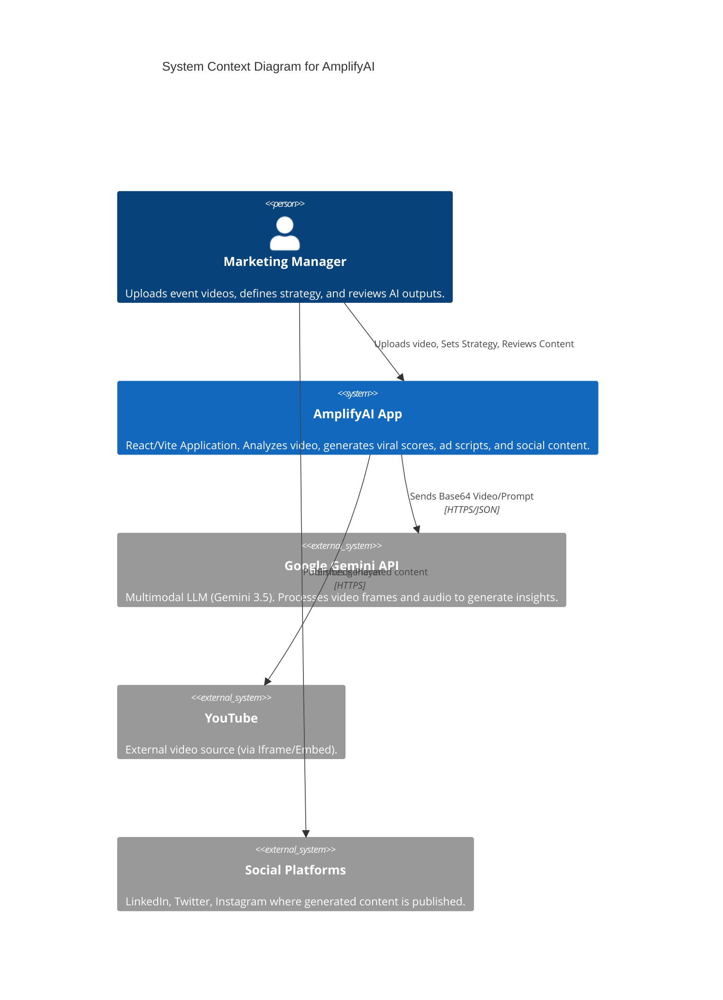
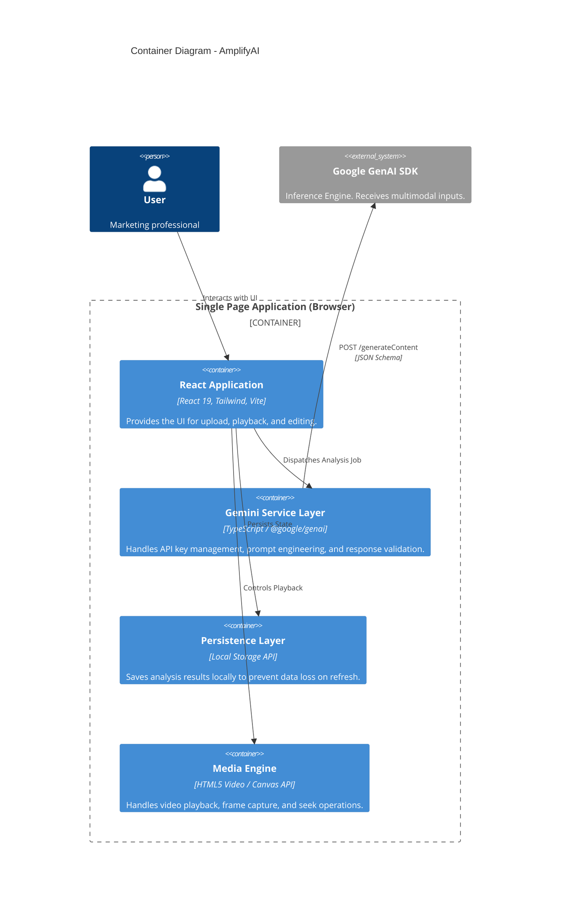
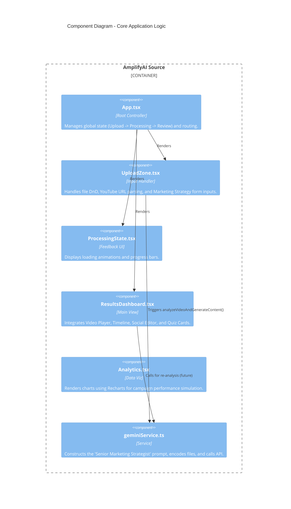
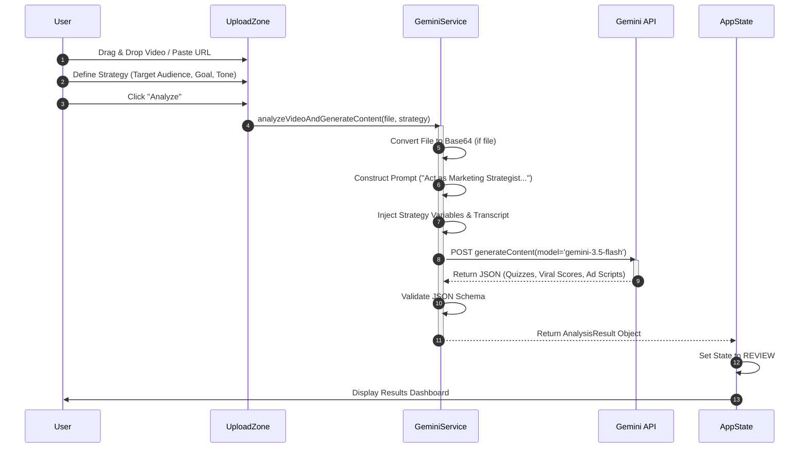
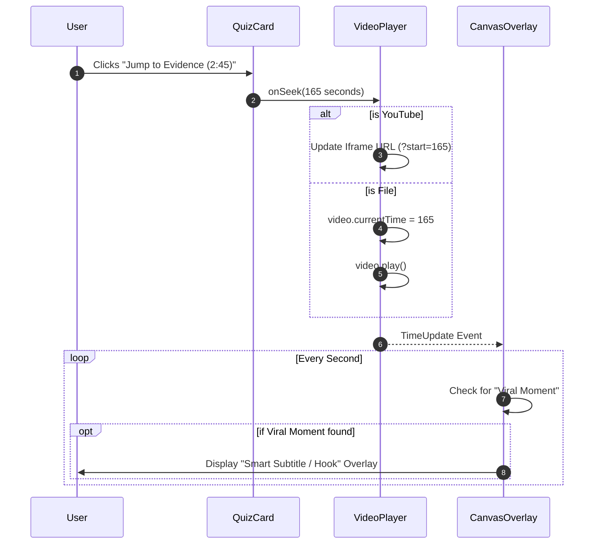
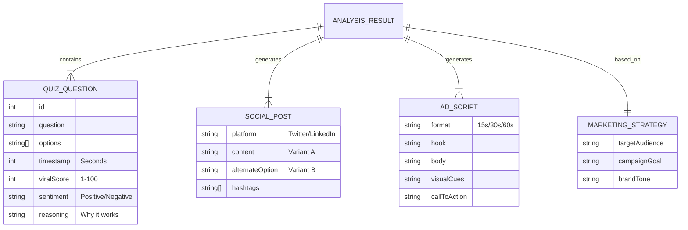
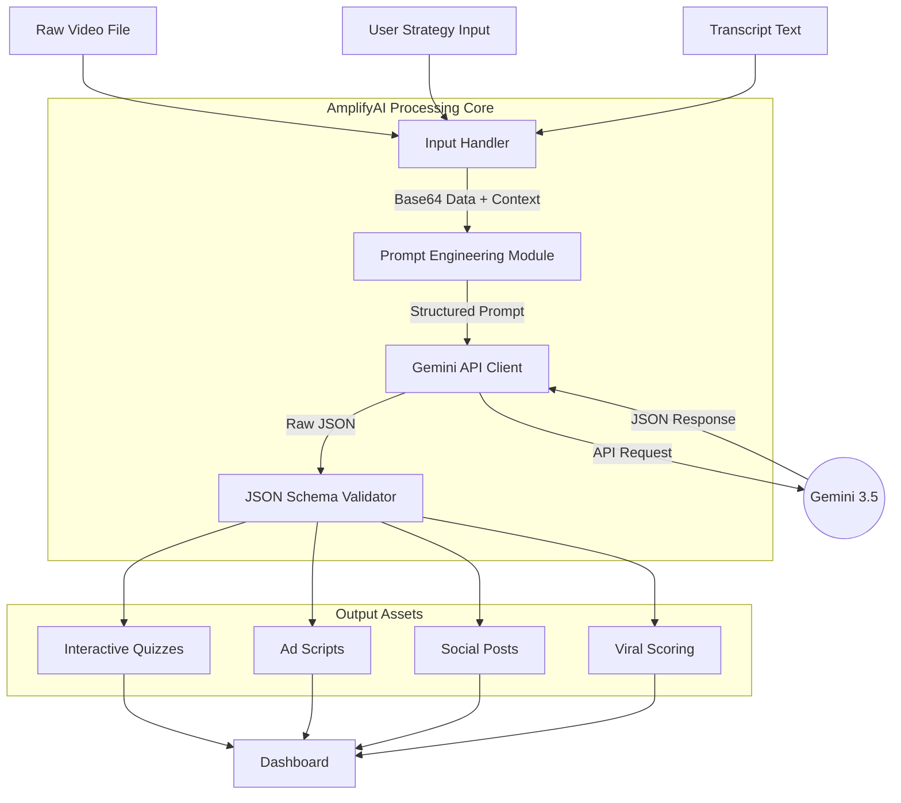

# System Architecture - AmplifyAI

This document provides a deep technical overview of **AmplifyAI**, an AI-powered autonomous marketing strategist application. It uses the C4 model for high-level architecture and standard UML/Mermaid diagrams for behavioral flows.

---

## 1. C1 - System Context Diagram
*The big picture view of how AmplifyAI fits into the marketing ecosystem.*

---

## 2. C2 - Container Diagram
*High-level technology choices and execution environment.*

---

## 3. C3 - Component Diagram
*Detailed breakdown of the React Application structure.*

---

## 4. Sequence Diagram: Analysis Workflow
*The step-by-step process of turning a raw video into a marketing campaign.*

---

## 5. Sequence Diagram: Interactive Playback
*How the "Jump to Evidence" feature works.*

---

## 6. Data Model (Conceptual ERD)
*The structure of the data generated by the AI.*

---

## 7. Data Flow Diagram (DFD)
*How data transforms through the pipeline.*

