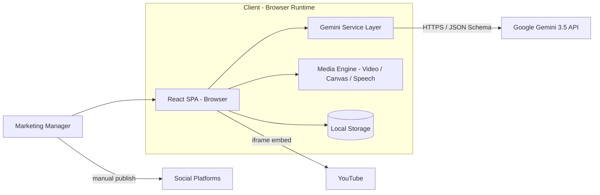
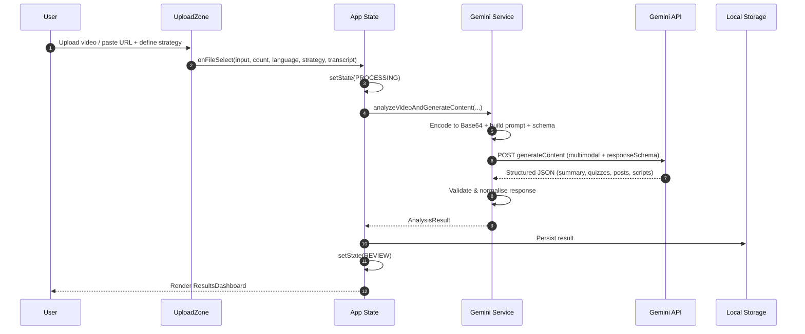
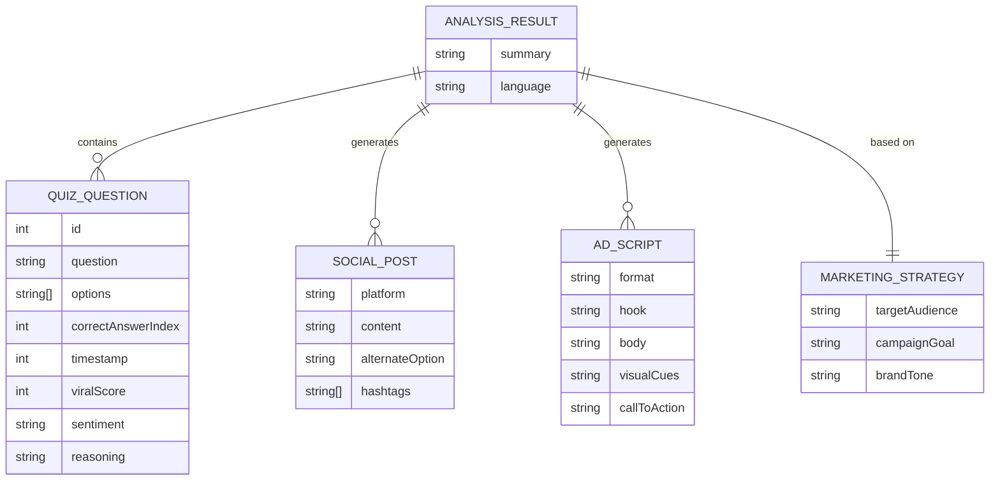
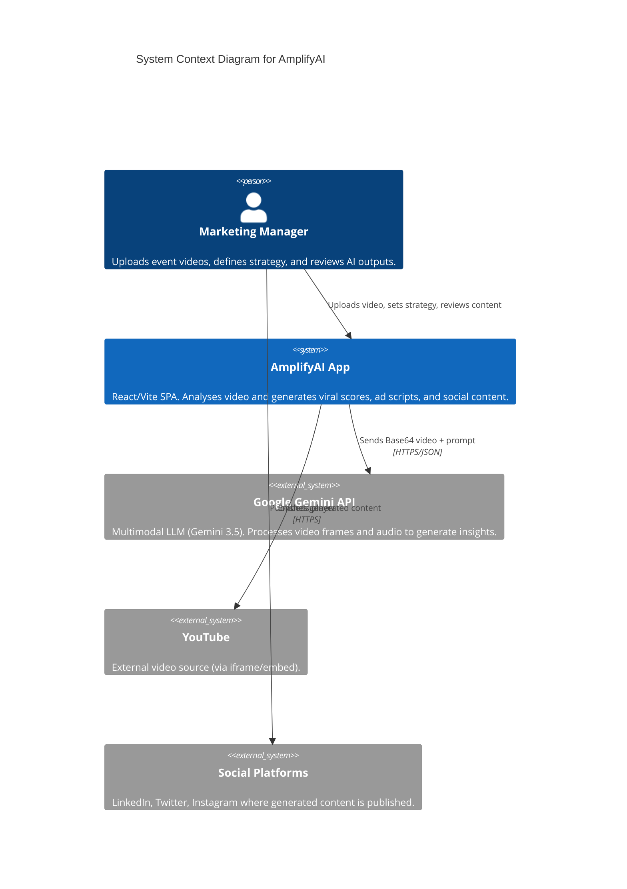
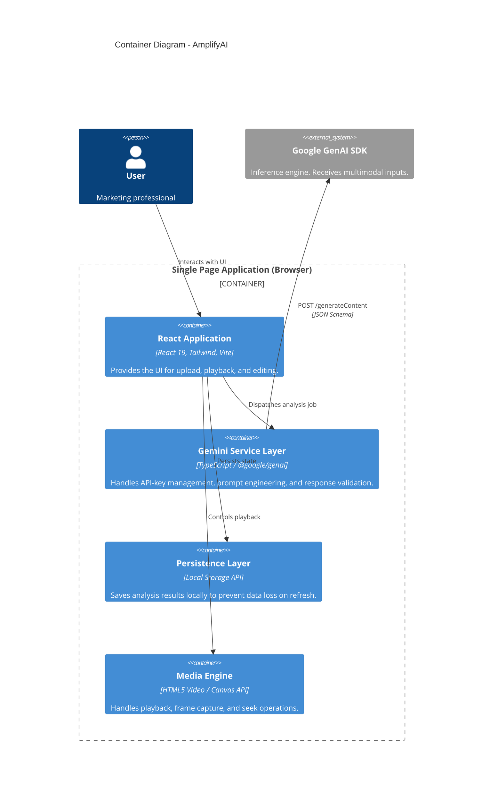
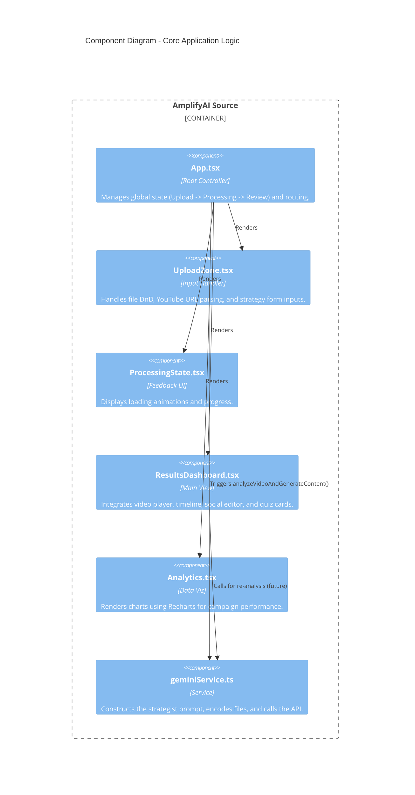
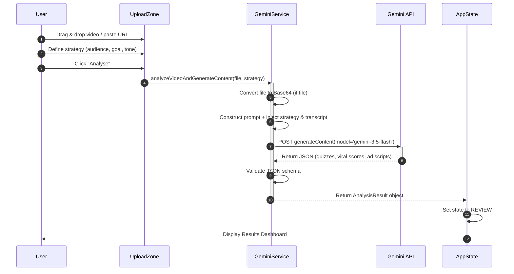
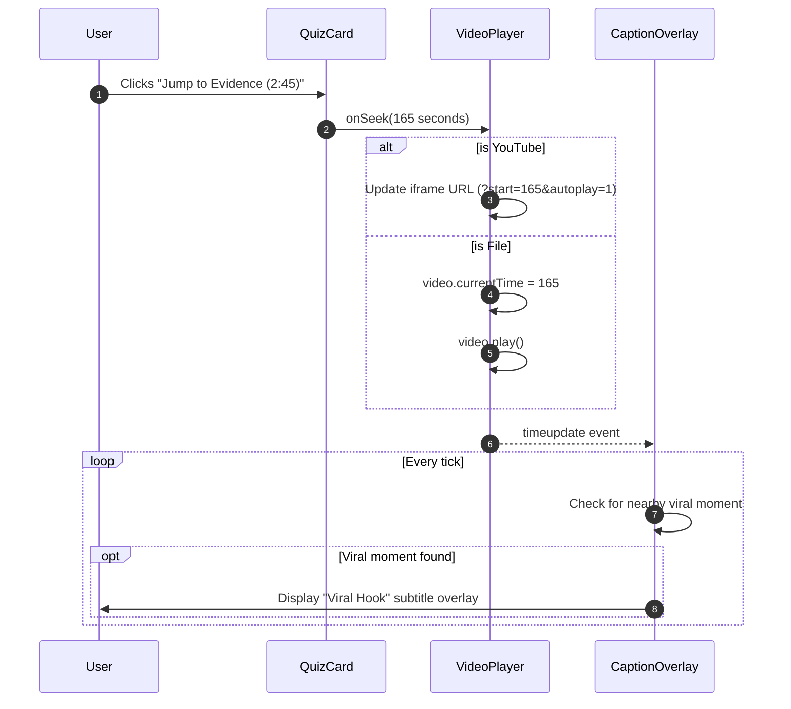
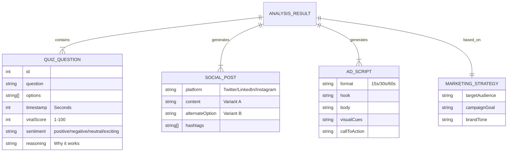
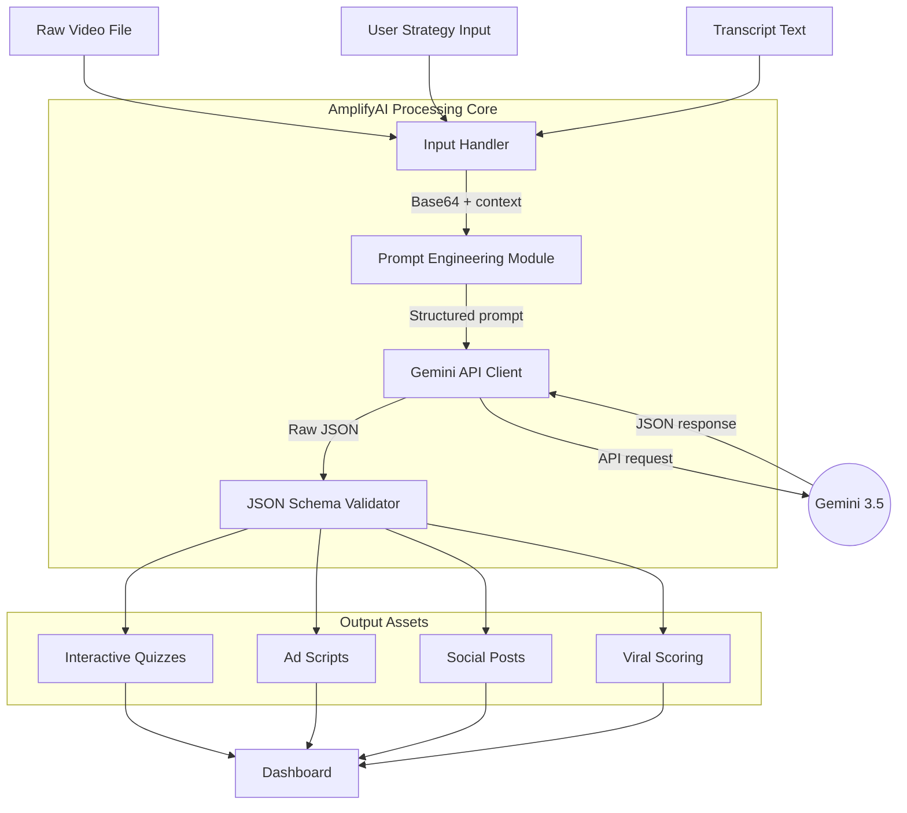

# System Architecture — AmplifyAI

## Overview

**AmplifyAI** is an autonomous video marketing strategist that transforms raw event footage (or a YouTube link) into a complete, platform-ready campaign package: interactive quizzes anchored to video timestamps, A/B-tested social posts, multi-length ad scripts, and viral-potential scoring. It functions as a "Senior Marketing Strategist in a box," wrapping Google's **Gemini 3.5 Flash** multimodal model in a focused, opinionated workflow.

Architecturally, AmplifyAI is a **client-side Single Page Application (SPA)**. There is no bespoke backend server; the browser is the application host. The React UI captures the user's media and marketing strategy, a thin **service layer** performs prompt engineering and media encoding, and all heavy inference is delegated to the external Gemini API. Results are rendered in an interactive dashboard and cached locally so work survives a page refresh. This design keeps the system simple to deploy and operate while still delivering rich, AI-driven functionality.

> ⚠️ **Assumption marker:** The current design is optimised for a demo/hackathon context. Production-grade concerns (server-side key handling, persistence, multi-user state) are called out.
---

## Key Requirements

The following functional and non-functional requirements drive the design.

### Functional
- Accept video input via **file upload** (MP4/WebM/MOV) or **YouTube URL** (with optional transcript).
- Let users define a **marketing strategy** (target audience, campaign goal, brand tone, language, question count).
- Generate, via multimodal AI: a strategic summary, timestamped quizzes with viral scores, A/B social posts, and 15s/30s/60s ad scripts.
- Provide **interactive playback** with sentiment timeline markers and "jump to evidence" seeking.
- Support **editing and export** (A/B editor, Canva CSV, plain-text report, frame capture).
- Offer **text-to-speech narration** for previewing generated copy.

### Non-Functional
- **Simplicity of deployment** — must run as static assets behind any CDN or static host.
- **Responsiveness** — UI remains interactive while a single long-running AI request is in flight.
- **Resilience** — graceful, user-friendly handling of API errors (rate limits, oversized files, safety blocks, network failures).
- **Localisation** — output in 12+ languages with cultural adaptation, not literal translation.
- **Data minimisation** — no server-side storage of user video; persistence is local to the browser.

---

## High-Level Architecture

AmplifyAI is composed of four logical parts running inside the browser, plus external services reached over HTTPS:

- **React Application (UI)** — stateful view layer that orchestrates the `UPLOAD → PROCESSING → REVIEW → ANALYTICS` flow.
- **Gemini Service Layer** — pure TypeScript module responsible for API-key resolution, Base64 media encoding, prompt construction, JSON-schema definition, and response validation.
- **Media Engine** — HTML5 `<video>`, the Canvas API (frame capture), and the Web Speech API (narration).
- **Persistence Layer** — the browser's Local Storage, holding the most recent analysis result.

External dependencies are the **Google Gemini API** (inference), **YouTube** (embedded playback), and the user's chosen **social platforms** (manual publishing of generated assets).

**What this shows:** All application logic executes in the browser. The only outbound dependency for core functionality is the Gemini API, called by the service layer. YouTube and social platforms sit at the edges. This matters because it keeps the deployment surface tiny (static files) and shifts compute cost to the managed AI service.

---

## Component Details

### 1. React Application (UI Host)
- **Responsibilities:** Global state machine (`AppState`: `UPLOAD`, `PROCESSING`, `REVIEW`, `ANALYTICS`), routing between views, error mapping, and persistence orchestration.
- **Key files:** `App.tsx` (root controller), `index.tsx` (bootstrap).
- **Technologies:** React 19, TypeScript 5.8, Tailwind CSS (CDN), lucide-react icons.
- **Owns:** In-memory `AnalysisResult`, the active `videoSource`, and user-facing error state.
- **Communicates with:** Dispatches analysis jobs to the Gemini Service Layer; reads/writes the Persistence Layer; renders child components.

### 2. UploadZone (Input Handler)
- **Responsibilities:** File drag-and-drop, file validation (type, ≤500MB), YouTube URL parsing, transcript capture, and the marketing-strategy form (including the one-click **KXSB preset**).
- **Key file:** `components/UploadZone.tsx`.
- **Owns:** Transient form state (audience, goal, tone, language, question count, transcript).
- **Communicates with:** Invokes the `onFileSelect` / `onUrlSelect` callbacks up to `App.tsx`.

### 3. Gemini Service Layer
- **Responsibilities:** The system's "brain wiring." Resolves the API key, converts files to Base64, constructs the "Senior Marketing Strategist" prompt with human-voice directives, injects strategy variables and transcript context, defines the strict `responseSchema`, calls the model, and validates/normalises the JSON response.
- **Key file:** `services/geminiService.ts`.
- **Technologies:** `@google/genai` SDK, Gemini 3.5 Flash model.
- **Owns:** Prompt templates, the response JSON schema, and a mock-analysis fallback (used for YouTube links without a transcript).
- **Communicates with:** `POST generateContent` over HTTPS to the Gemini API; returns a typed `AnalysisResult` to the UI.

### 4. ResultsDashboard (Primary View)
- **Responsibilities:** Integrates the video player, sentiment timeline, interactive quiz cards, the side-by-side A/B social editor, ad-script cards, the Narrator Voice Customizer, and all export functions (Canva CSV, text report, frame capture).
- **Key file:** `components/ResultsDashboard.tsx`.
- **Technologies:** HTML5 Video, Canvas API, Web Speech (SpeechSynthesis) API.
- **Owns:** Editable copies of social posts, playback state, and narration configuration.

### 5. Analytics (Data Visualisation)
- **Responsibilities:** Renders a goal-aware performance dashboard (KPI cards, engagement bar chart, growth-velocity line chart). Metrics are currently **simulated** for demonstration.
- **Key file:** `components/Analytics.tsx`.
- **Technologies:** Recharts.
- **Owns:** Static/derived demo datasets keyed off the campaign goal.

### 6. Persistence Layer
- **Responsibilities:** Saves the latest `AnalysisResult` to `localStorage` (`amplifyAiResult`) and rehydrates it on load to survive refreshes.
- **Technologies:** Browser Local Storage API.
- **Owns:** A single serialised analysis record. **Note:** raw video is never persisted.

### 7. External Integrations
- **Google Gemini API:** Multimodal inference; receives Base64 video + prompt, returns schema-constrained JSON.
- **YouTube:** Iframe embed for playback and timestamp seeking via `?start=` URL parameters.
- **Social Platforms:** Destination for manually published, generated assets (no automated API integration today).

---

## Data Flow

### Primary flow — "Analyse a video"

**What this shows:** A single user action triggers one long-running inference call. The UI transitions to a `PROCESSING` state to stay responsive, then renders results once validated. Errors thrown by the service are caught in `App.tsx` and mapped to friendly messages (e.g., invalid key, 413 oversized file, 503 overloaded, safety block).

### Secondary flow — "Jump to evidence"
When a user clicks a quiz's timestamp, the dashboard seeks the player: for uploaded files it sets `video.currentTime`; for YouTube it rebuilds the embed URL with `?start=<seconds>&autoplay=1`. A `timeupdate` loop drives the on-video "Viral Hook" caption overlay.

---

## Data Model (High-Level)

The AI returns a single root object, `AnalysisResult`, which aggregates the generated assets. Key entities and relationships (defined in `types.ts`):

**What this shows:** `AnalysisResult` is the aggregate root that owns collections of quizzes, social posts, and ad scripts, plus the `MarketingStrategy` it was generated from. There is no relational database — these are transient, JSON-serialisable structures held in memory and Local Storage.

---

## Infrastructure & Deployment

- **Build tool:** Vite 6 produces an optimised static bundle (`vite build`).
- **Runtime:** Pure static assets (HTML, JS, CSS) — no application server required.
- **Hosting:** Suitable for any static host or CDN (e.g., Vercel, Netlify, GitHub Pages, S3 + CloudFront). `<ADD CHOSEN HOST HERE>`
- **Local dev:** `vite` dev server on port `3000`, host `0.0.0.0` (see `vite.config.ts`).
- **Configuration:** `GEMINI_API_KEY` is injected at build time via Vite's `define` into `process.env.API_KEY` / `process.env.GEMINI_API_KEY`; `VITE_API_KEY` is also read via `import.meta.env`.

### Environments

| Environment | Purpose | Notes |
| --- | --- | --- |
| **Development** | Local iteration | Vite dev server, hot reload, `.env` with a personal Gemini key. |
| **Staging** | Pre-release validation | `<ADD STAGING DETAILS HERE>` — same static build with a restricted key. |
| **Production** | Public/demo deployment | Static build on a CDN. For real production, route Gemini calls through a backend proxy. |

---

## Scalability & Reliability

Because compute is client-side and inference is delegated to a managed API, scaling is largely a **static-hosting and third-party-quota** concern rather than a server-capacity one.

- **Horizontal scale:** Static assets scale trivially via CDN edge caching; there is no server tier to scale.
- **Load handling:** Each browser session performs its own AI calls, so concurrent users do not contend for shared backend resources — they contend only for the Gemini **API quota/rate limits**.
- **Failure handling:** The service layer surfaces typed errors; `App.tsx` maps them to specific user messages and returns the app to a safe `UPLOAD` state. A **mock-analysis fallback** keeps the YouTube demo path functional when no transcript is supplied.
- **Resilience gaps (current):** No retry/back-off or request queueing is implemented. `<ADD RETRY/BACKOFF STRATEGY HERE>`
- **Recommended for production:** Introduce a lightweight backend proxy for rate-limit smoothing, request queuing, and graceful degradation.

---

## Security & Compliance

- **API key handling (current):** The Gemini key is embedded in the client bundle at build time. This is acceptable only for trusted/demo environments. **Production must** move calls behind a server-side proxy so the key never reaches the browser. `<ADD PRODUCTION KEY-HANDLING STRATEGY HERE>`
- **Transport security:** All Gemini and YouTube calls use HTTPS.
- **Data minimisation:** Raw user video is processed in-memory and sent to Gemini for analysis; it is **not** persisted server-side. Only the textual `AnalysisResult` is cached in Local Storage.
- **Content safety:** Gemini's safety filters may block content; the UI handles "Candidate was blocked" responses gracefully.
- **AuthN / AuthZ:** None today — the app is single-user and unauthenticated. `<ADD AUTH STRATEGY HERE if multi-user is introduced>`.
- **Compliance considerations:** If processing third-party or personal data at scale, review GDPR/data-processing terms for the Gemini API and obtain appropriate consent for uploaded media. `<ADD COMPLIANCE SCOPE HERE>`

---

## Observability

The current build relies on browser-native tooling; structured observability is a planned improvement.

- **Logging:** `console.error` / `console.warn` capture service errors and fallback usage; visible via browser dev tools.
- **Metrics:** No client analytics instrumented today. `<ADD METRICS/RUM TOOL HERE>` (e.g., Sentry, PostHog, or a privacy-friendly RUM).
- **Tracing:** Not applicable to the single-call client flow; if a backend proxy is added, propagate a request/correlation ID for end-to-end tracing.
- **User-facing feedback:** The `ProcessingState` component and mapped error messages provide real-time status to users in lieu of backend telemetry.

---

## Trade-offs & Decisions

- **Client-only architecture (no backend):** *Chosen for* rapid delivery, zero server ops, and a tiny deployment footprint. *Trade-off:* the API key is exposed and there's no central place for rate-limiting, retries, or auth — hence the production proxy recommendation.
- **Local Storage persistence:** *Chosen for* a frictionless single-user experience with refresh-survival. *Trade-off:* no cross-device sync, no multi-user history, and a storage-size ceiling.
- **Strict `responseSchema` with Gemini:** *Chosen to* guarantee well-formed, typed output and avoid brittle free-text parsing. *Trade-off:* schema changes require coordinated prompt + type updates.
- **Mock-analysis fallback for YouTube-without-transcript:** *Chosen to* keep demos reliable without scraping YouTube. *Trade-off:* results are simulated, clearly flagged as "Demo Mode" in the UI.
- **Tailwind via CDN:** *Chosen for* setup speed. *Trade-off:* less build-time purging/optimisation than a compiled Tailwind pipeline.
- **Browser SpeechSynthesis for narration:** *Chosen to* avoid extra TTS API cost/keys. *Trade-off:* voice quality and availability vary by OS/browser.

---

## Future Improvements

- [ ] **Backend proxy / BFF** to secure the API key and centralise rate-limiting, retries, and queuing.
- [ ] **Server-side persistence** (database) for cross-device history, team workspaces, and shareable campaign links.
- [ ] **Real YouTube transcript fetching** to replace the mock fallback.
- [ ] **Direct publishing integrations** (LinkedIn, X, Instagram APIs) for one-click distribution.
- [ ] **Real analytics** wired to actual campaign data, replacing simulated metrics.
- [ ] **Automated test suite** (Vitest + React Testing Library) and CI/CD pipeline.
- [ ] **Structured observability** (error tracking, RUM, optional backend tracing).
- [ ] **Resilience hardening** — exponential back-off, request chunking for large videos, and streaming responses.
- [ ] **Compiled Tailwind build** and bundle-size optimisation for production.

---

## Appendix A: Detailed Diagrams (C4 Model & Behavioural Views)

This appendix provides a deeper, formal view of the system using the **C4 model** (Context → Container → Component) alongside sequence, data-model, and data-flow diagrams. The high-level architecture above is the quick read; these diagrams are the detailed reference.

### A.1 — C1: System Context Diagram

The big-picture view of how AmplifyAI fits into the wider marketing ecosystem.

**What this shows:** A single human actor (the Marketing Manager) interacts with one software system (AmplifyAI), which depends on three external systems. It frames the system boundary and clarifies that Gemini is the only dependency required for core analysis.

### A.2 — C2: Container Diagram

High-level technology choices and the execution environment, all within the browser boundary.

**What this shows:** The four logical containers all run inside the browser; only the Gemini SDK call leaves the client. This reinforces the "static deployment, managed inference" trade-off.

### A.3 — C3: Component Diagram

A detailed breakdown of the React application's internal structure.

**What this shows:** How the root controller (`App.tsx`) orchestrates the view components and where the service boundary sits. `UploadZone` is the primary trigger of the analysis service.

### A.4 — Sequence Diagram: Analysis Workflow

The step-by-step process of turning a raw video into a marketing campaign.

**What this shows:** The full request lifecycle and where validation occurs. It highlights that the long-running step is the single Gemini call, framed by client-side encoding and validation.

### A.5 — Sequence Diagram: Interactive Playback

How the "Jump to Evidence" and smart-caption features work.

**What this shows:** The branching playback logic for uploaded files versus YouTube embeds, plus the time-driven loop that renders contextual caption overlays.

### A.6 — Data Model (Conceptual ERD)

The structure of the data generated by the AI and held in memory / Local Storage.

**What this shows:** `ANALYSIS_RESULT` is the aggregate root that owns the generated assets and references the strategy it was produced from. There is no relational store — these are transient JSON structures.

### A.7 — Data Flow Diagram (DFD)

How data transforms as it moves through the processing pipeline.

**What this shows:** The transformation pipeline from three raw inputs (video, strategy, transcript) through prompt construction and validation into the four output asset types rendered on the dashboard. It clarifies where validation gates untrusted model output before display.

