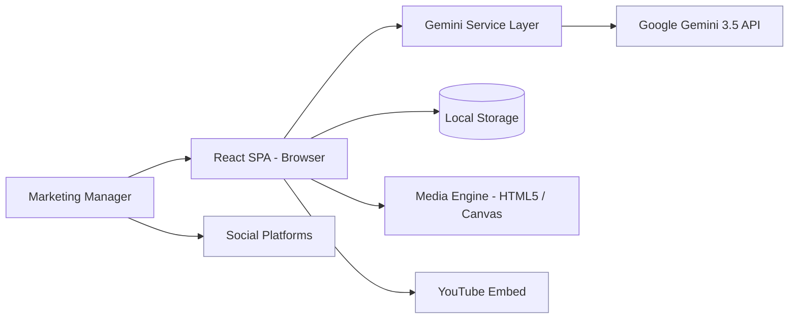
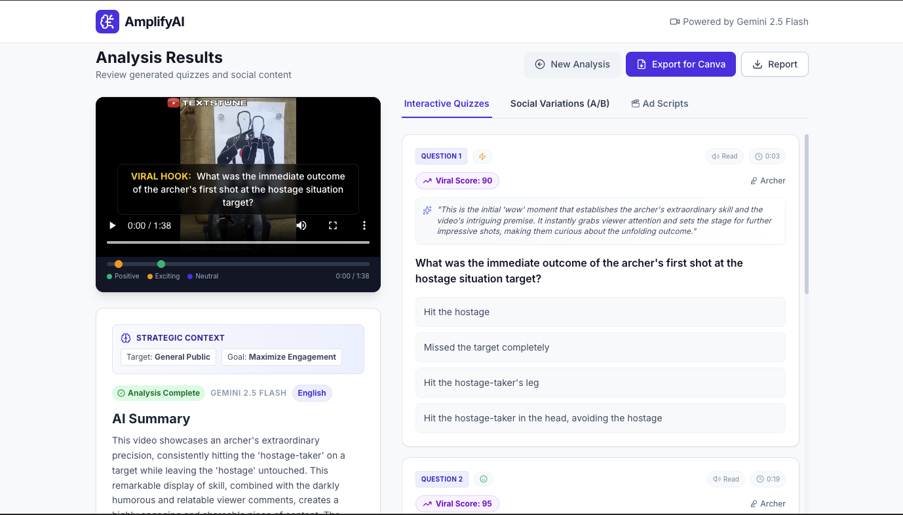
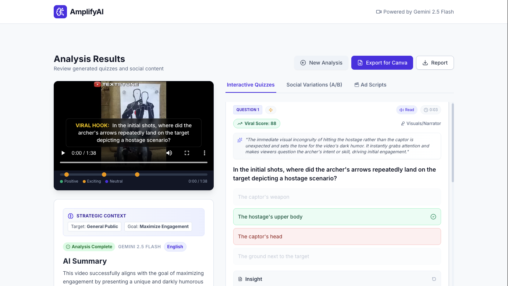
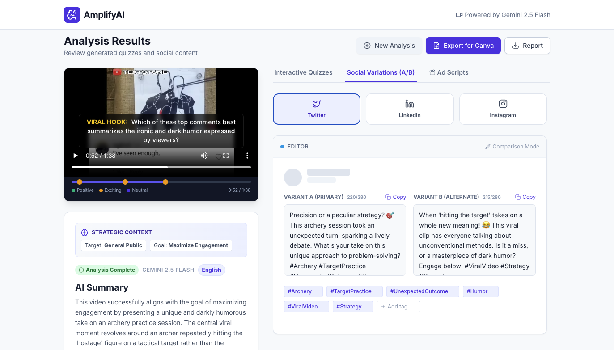
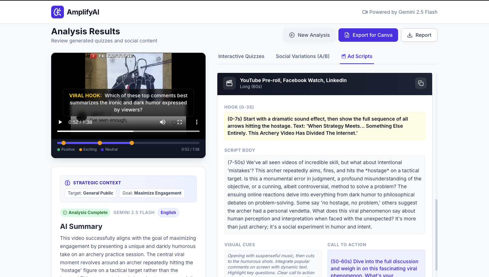
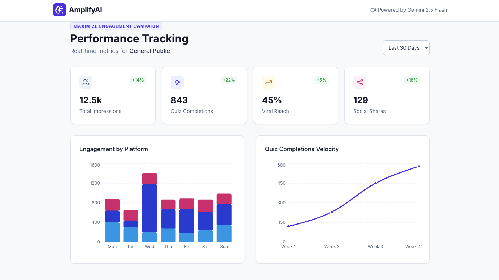

# AmplifyAI

> Your autonomous video marketing strategist — turn raw event footage into viral quizzes, ad scripts, and social campaigns in minutes.

<!-- Badges (replace placeholders with live badge URLs once CI/CD is set up) -->


**🎥 [Watch the Demo Video](https://share.screenshow.app/shareablevideos/ueIVv7)**

---

## Description


**AmplifyAI** is an AI-powered marketing agent that acts as a "Senior Marketing Strategist in a box." Instead of manually watching hours of webinars, keynotes, podcasts, or event footage, you upload the video (or paste a YouTube link), define your **Target Audience**, **Campaign Goal**, and **Brand Tone**, and AmplifyAI uses **Google's Gemini 3.5 multimodal model** to automatically produce high-engagement, platform-ready marketing assets.

The result is a complete campaign package: interactive trivia quizzes anchored to video timestamps, A/B-tested social posts for Twitter/LinkedIn/Instagram, multi-length video ad scripts, viral-potential scoring, and a simulated analytics dashboard — all tailored to your strategy and available in 12+ languages.

**Who it's for:** marketing managers, content creators, social media teams, and event organizers who need to repurpose long-form video into scalable, personalized campaigns without a full production team.

**The problem it solves:** the content bottleneck. AmplifyAI compresses the slow, manual work of clipping, scripting, and copywriting into a single automated workflow.

---

## Table of Contents

- [Description](#description)
- [Features](#features)
- [Tech Stack](#tech-stack)
- [Architecture Overview](#architecture-overview)
- [Installation](#installation)
- [Usage](#usage)
- [Configuration](#configuration)
- [Screenshots / Demo](#screenshots--demo)
- [API / Service Reference](#api--service-reference)
- [Tests](#tests)
- [Roadmap](#roadmap)
- [Contributing](#contributing)
- [License](#license)
- [Contact / Support](#contact--support)

---

## Features

- **🧠 Strategic Context Engine** — Tell the AI who you're targeting and what you want to achieve; it adapts tone, clip selection, and copywriting to match. Includes a one-click **KXSB preset** for a bold, futuristic brand voice.

- **🎬 Multimodal Ad Scripting** — Auto-generates production-ready scripts in three formats: Short (15s) for TikTok/Reels, Medium (30s) for LinkedIn, and Long (60s) for YouTube ads — each with a hook, body, visual cues, and CTA.

- **🧪 A/B Testing & Side-by-Side Editor** — Generates two variations (Primary vs. Alternate) for every social post and lets you compare and edit them simultaneously in a split-view editor.

- **📈 Viral Potential Scoring** — Assigns a 1–100 Viral Score to key moments and explains *why* each clip resonates with the target audience.

- **🌍 Global Campaigns** — Cross-language repurposing into 12+ languages (Spanish, French, German, Portuguese, Japanese, Chinese, Italian, Russian, Arabic, Hindi, Korean) with cultural localization, not just literal translation.

- **🎮 Interactive "Playable" Quizzes** — Turns passive footage into active engagement with a "Jump to Evidence" feature that seeks the player to the exact timestamp where an answer is revealed.

- **🎙️ Narrator Voice Customizer** — Browser-based text-to-speech with selectable voices, adjustable speed/pitch, and a "human-sounding" narrator profile for previewing scripts and quizzes.

- **📊 Campaign Analytics Dashboard** — Simulated performance metrics (impressions, viral reach, shares) with goal-aware KPIs rendered via interactive Recharts visualizations.

- **🎯 Sentiment Timeline** — Color-coded markers on the video timeline highlight Positive, Exciting, and Neutral moments.

- **📤 Export & Persistence** — One-click export to a Canva-ready CSV, downloadable strategy reports, video frame capture, and automatic local persistence so work survives a page refresh.

---

## Tech Stack

| Layer | Technology |
| --- | --- |
| **Framework** | React 19 |
| **Language** | TypeScript 5.8 |
| **Build Tool** | Vite 6 |
| **AI / LLM** | Google Gemini 3.5 Flash via `@google/genai` |
| **Styling** | Tailwind CSS (CDN) + Inter font |
| **Icons** | lucide-react |
| **Charts** | Recharts |
| **Persistence** | Browser Local Storage API |
| **Media** | HTML5 Video, Canvas API, Web Speech (SpeechSynthesis) API |

---

## Architecture Overview

AmplifyAI is a client-side Single Page Application (SPA). The React UI captures the user's video and marketing strategy, the **Gemini Service Layer** handles prompt engineering and encodes the media to Base64, and the **Google GenAI API** returns structured JSON (quizzes, scores, scripts, posts) validated against a strict schema. Analysis results are persisted to Local Storage, and an embedded media engine drives playback, timeline seeking, and frame capture.



**How it works:** The user interacts with the React **WebApp**, which dispatches an analysis job to the **Gemini Service Layer**. The service sends a multimodal prompt (video + strategy context) to the **Google Gemini API** and receives schema-validated JSON. Results render in the dashboard, are cached in **Local Storage**, and external services (**YouTube** for embeds, **Social Platforms** for publishing) integrate at the edges.

> For deeper technical detail — C4 context/container/component diagrams, sequence diagrams, the conceptual ERD, and data-flow diagrams — see [ARCHITECTURE.md](./ARCHITECTURE.md).

---

## Installation

### Prerequisites

- **Node.js** `18+` (recommended LTS) and **npm**
- A **Google Gemini API key** — get one from [Google AI Studio](https://aistudio.google.com/)

### Steps

1. **Clone the repository**
   ```bash
   git clone https://github.com/<YOUR_GITHUB_USERNAME>/AmplifyAI.git
   cd AmplifyAI
   ```

2. **Install dependencies**
   ```bash
   npm install
   ```

3. **Configure your API key** — create a `.env` file in the project root (see [Configuration](#configuration)):
   ```env
   GEMINI_API_KEY=your_google_ai_studio_api_key
   ```

4. **Start the development server**
   ```bash
   npm run dev
   ```
   The app will be available at **http://localhost:3000**.

---

## Usage

### Run locally

```bash
# Development server with hot reload (http://localhost:3000)
npm run dev

# Production build
npm run build

# Preview the production build locally
npm run preview
```

### Workflow

1. **Upload or Link** — Drag & drop an event video (`MP4`, `WebM`, or `MOV`, up to 500MB) or switch to the YouTube tab and paste a link.
2. **Define Strategy** — Set your **Target Audience**, **Campaign Goal**, **Brand Tone**, output **Language**, and number of quiz questions. Use the **KXSB Preset** for a quick start.
3. **Add Transcript (optional)** — Paste captions/transcript to improve fact extraction accuracy (required for real analysis of YouTube links).
4. **Analyze** — Gemini processes the video and returns your campaign package.
5. **Review & Edit** — Jump to viral moments via the sentiment timeline, refine A/B social posts in the side-by-side editor, preview scripts with the narrator, then export to Canva CSV or download the full report.

> **No video handy?** Click **"Try Live Demo"** on the upload screen to explore a pre-loaded sample analysis.

### Example: calling the analysis service in code

```ts
import { analyzeVideoAndGenerateContent } from './services/geminiService';
import type { MarketingStrategy } from './types';

const strategy: MarketingStrategy = {
  targetAudience: 'Tech Savvy Investors & Gen Z',
  campaignGoal: 'Showcase Innovation & AI Leadership',
  brandTone: 'Bold, Futuristic, and Authentic',
};

const result = await analyzeVideoAndGenerateContent(
  videoFile,   // File | string (YouTube URL)
  5,           // number of quiz questions
  'English',   // output language
  strategy,    // marketing strategy
  transcript,  // optional transcript text
);

console.log(result.summary);
console.log(result.quizzes, result.socialPosts, result.adScripts);
```

---

## Configuration

Configuration is handled through environment variables loaded by Vite. Create a `.env` file in the project root.

| Variable | Required | Description |
| --- | --- | --- |
| `GEMINI_API_KEY` | ✅ | Your Google Gemini API key. Injected into `process.env.API_KEY` and `process.env.GEMINI_API_KEY` at build time (see `vite.config.ts`). |
| `VITE_API_KEY` | ➖ | Alternative key variable read directly via `import.meta.env` in some build setups. |

```env
# .env
GEMINI_API_KEY=your_google_ai_studio_api_key
```

**Other notable settings:**

- **Dev server port** — defined in `vite.config.ts` (`server.port: 3000`, host `0.0.0.0`).
- **Path alias** — `@` resolves to the project root.
- **File limits** — the UI caps uploads at 500MB; the Gemini API works best with files under ~20MB for this demo.

> ⚠️ **Security note:** This is a client-side application, so the API key is exposed in the browser bundle. For production, proxy Gemini requests through a backend service and keep your key server-side. `<ADD PRODUCTION KEY-HANDLING STRATEGY HERE>`

---

## Screenshots / Demo

### 🎥 Video Demo

Watch the full walkthrough of AmplifyAI turning raw footage into quizzes, ad scripts, and social campaigns:

**▶️ [Watch the Demo Video](https://share.screenshow.app/shareablevideos/ueIVv7)**

[](https://share.screenshow.app/shareablevideos/ueIVv7)

> Click the image above to play the demo.

### Interactive Quizzes & Viral Scoring

The results dashboard pairs the source video (with a live "Viral Hook" caption overlay and sentiment timeline) with AI-generated trivia, per-question Viral Scores, and strategic reasoning.


### Answer Reveal & "Jump to Evidence"
Each quiz highlights the correct answer and links straight back to the exact timestamp in the video where the answer is revealed.



### Social Variations (A/B Editor)
Compare and edit Primary vs. Alternate post variants side-by-side for Twitter, LinkedIn, and Instagram — with live character counts and editable hashtags.



### Multi-Length Ad Scripts
Production-ready 15s / 30s / 60s scripts, each with a hook, script body, visual cues, and call to action.



### Campaign Analytics
A goal-aware performance dashboard with KPI cards and interactive Recharts visualizations for engagement and growth velocity.



**Live demo / video walkthrough:** [share.screenshow.app/shareablevideos/ueIVv7](https://share.screenshow.app/shareablevideos/ueIVv7)


---

## API / Service Reference

AmplifyAI has no public REST/CLI API — its core logic is exposed through the TypeScript **Gemini Service Layer** (`services/geminiService.ts`).

### `analyzeVideoAndGenerateContent(input, questionCount?, language?, strategy?, transcript?)`

Analyzes a video and returns a structured campaign package.

| Parameter | Type | Default | Description |
| --- | --- | --- | --- |
| `input` | `File \| string` | — | A video `File` or a YouTube URL string. |
| `questionCount` | `number` | `3` | Number of quiz questions to generate (1–10). |
| `language` | `SupportedLanguage` | `'English'` | Output language for all generated assets. |
| `strategy` | `MarketingStrategy` | General/Professional | Target audience, campaign goal, and brand tone. |
| `transcript` | `string` | `undefined` | Optional transcript to improve accuracy. |

**Returns:** `Promise<AnalysisResult>` containing `summary`, `quizzes[]`, `socialPosts[]`, and `adScripts[]`.

```ts
// Response shape (simplified from types.ts)
interface AnalysisResult {
  summary: string;
  quizzes: QuizQuestion[];     // question, options, timestamp, viralScore, reasoning, sentiment
  socialPosts: SocialPost[];   // platform, content, alternateOption (A/B), hashtags
  adScripts: AdScript[];       // format, hook, body, visualCues, callToAction
  language?: SupportedLanguage;
  strategyUsed?: MarketingStrategy;
}
```

---

## Tests

> No automated test suite is currently configured. `<ADD TEST FRAMEWORK HERE>` (e.g., Vitest + React Testing Library).

A suggested setup once tests are added:

```bash
# Example — once a test runner is configured
npm test
```

In the meantime, you can validate the build manually:

```bash
npm run build && npm run preview
```

---

## Roadmap

- [ ] Add an automated test suite (Vitest + React Testing Library)
- [ ] Backend proxy for secure server-side API key handling
- [ ] Direct publishing integrations (LinkedIn, X, Instagram APIs)
- [ ] Real YouTube transcript fetching (replace mock fallback)
- [ ] AI-generated thumbnail / clip rendering for detected viral moments
- [ ] Real analytics integration to replace simulated metrics
- [ ] Team workspaces and shareable campaign links

---

## Contributing

Contributions are welcome! To get started:

1. **Fork** the repository and create a feature branch:
   ```bash
   git checkout -b feature/your-feature-name
   ```
2. **Commit** your changes with clear messages.
3. **Push** to your fork and open a **Pull Request** describing your changes.

Please open an **Issue** first for major changes or new features to discuss the approach. For bug reports, include reproduction steps, expected vs. actual behavior, and your environment details.

---

## License

Distributed under the **MIT License**. See the [`LICENSE`](./LICENSE) file for full terms.

---

## Contact / Support

- **Maintainer:** `@masterasnackin`
- **GitHub:** `@masterasnackin`

For questions, bug reports, or feature requests, please [open an issue](https://github.com/masterasnackin/AmplifyAI/issues).

---

<p align="center">© 2026 AmplifyAI — Built with Gemini &amp; React.</p>
