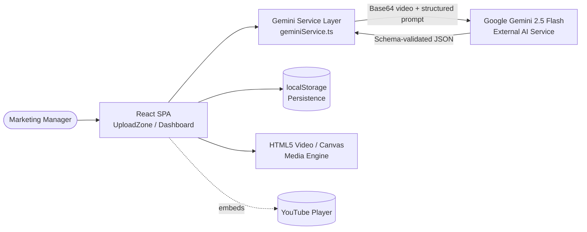

# AmplifyAI

> The Autonomous Video Marketing Strategist — turn raw event footage into viral quizzes, ad scripts, and social campaigns with Multimodal AI.

<!-- Replace the placeholder badges below with live badges from your CI/registry once available. -->


---

## Description

**AmplifyAI** is an AI-powered marketing agent that acts as a *"Senior Marketing Strategist in a Box."* Instead of manually reviewing hours of webinars, keynotes, or podcasts, you upload a video (or paste a YouTube link), define your **Target Audience**, **Campaign Goal**, and **Brand Tone**, and AmplifyAI uses **Google's Gemini 2.5 Flash** multimodal model to automatically produce a complete, strategy-aligned marketing campaign.

The result is a single-page application that converts long-form video into **interactive quizzes**, **A/B-tested social posts**, **multi-format video ad scripts**, and **viral-potential scoring** — all localized to 12+ languages.

- **What it solves:** the content bottleneck — repurposing long video into many high-engagement assets is slow and expensive.
- **Who it's for:** marketing managers, content teams, event organizers, growth marketers, and agencies who need to scale video repurposing.

---

## Table of Contents

- [Description](#description)
- [Features](#features)
- [Tech Stack](#tech-stack)
- [Architecture Overview](#architecture-overview)
- [Installation](#installation)
- [Usage](#usage)
- [Configuration](#configuration)
- [Screenshots / Demo](#screenshots--demo)
- [API Reference](#api-reference)
- [Tests](#tests)
- [Roadmap](#roadmap)
- [Contributing](#contributing)
- [License](#license)
- [Contact / Support](#contact--support)

---

## Features

- **🧠 Strategic Context Engine** — Tell the AI your target audience, campaign goal, and brand tone; it adapts clip selection, writing style, and reasoning to match.
- **🎬 Multimodal Ad Scripting** — Auto-generates production-ready video scripts in three formats: Short (15s) for TikTok/Reels, Medium (30s) for LinkedIn, and Long (60s) for YouTube Ads, with hooks, body, CTA, and visual cues.
- **🧪 A/B Testing & Side-by-Side Editor** — Produces two variations (Primary vs. Alternate) for every Twitter, LinkedIn, and Instagram post so you can compare and refine.
- **📈 Viral Potential Scoring** — Assigns a 1–100 Viral Score to key moments with strategic reasoning explaining *why* each clip will resonate.
- **🌍 Global Campaigns** — Cross-language repurposing into 12+ languages (English, Spanish, French, German, Portuguese, Japanese, Chinese, Italian, Russian, Arabic, Hindi, Korean) with cultural localization.
- **🎮 Interactive "Playable" Quizzes** — Trivia generated from real video moments, with a **Jump to Evidence** feature that seeks the player to the exact timestamp and a sentiment-coded timeline.
- **💾 Local Persistence** — Results are saved to `localStorage` so a page refresh won't lose your generated campaign.
- **🔗 Flexible Inputs** — Upload a video file (MP4/WebM/MOV), paste a YouTube URL with a transcript, or load a built-in demo.

---

## Tech Stack

| Layer | Technology |
| --- | --- |
| Frontend Framework | React 19 |
| Language | TypeScript 5.8 |
| Build Tool / Dev Server | Vite 6 |
| AI / LLM | Google Gemini 2.5 Flash via `@google/genai` |
| Charts / Data Viz | Recharts |
| Icons | lucide-react |
| Styling | Tailwind CSS (CDN) + Inter font |
| Persistence | Browser `localStorage` |

> **Note:** This is a fully client-side SPA. There is no dedicated backend server — the browser communicates directly with the Google GenAI SDK.

---

## Architecture Overview

AmplifyAI is a browser-based single-page application. The React UI collects the video and marketing strategy, the **Gemini Service Layer** performs prompt engineering and encodes media to Base64, and the **Google GenAI SDK** returns structured JSON validated against a strict schema. Results are rendered in the dashboard and cached in `localStorage`.



**How it works:** The user interacts with the **React SPA** to upload media and define a strategy. The **Gemini Service Layer** constructs a "Senior Marketing Strategist" prompt, encodes the video, and calls the **Gemini API**, which returns schema-validated JSON. The app renders the assets in the dashboard, persists them to `localStorage`, and uses the **Media Engine** (and optional YouTube embed) for interactive "jump to evidence" playback.

> A deeper technical breakdown — including C4 context/container/component diagrams, sequence diagrams, the data model (ERD), and a data-flow diagram — is available in [`ARCHITECTURE.md`](./ARCHITECTURE.md).

---

## Installation

### Prerequisites

- **Node.js** 18+ (Node 20 LTS recommended)
- **npm** 9+ (bundled with Node)
- A **Google Gemini API key** — get one from [Google AI Studio](https://aistudio.google.com/)

### Steps

1. **Clone the repository**
   ```bash
   git clone https://github.com/<ADD-GITHUB-USER>/amplify-ai.git
   cd amplify-ai
   ```

2. **Install dependencies**
   ```bash
   npm install
   ```

3. **Configure your API key** — create a `.env` (or `.env.local`) file in the project root:
   ```env
   GEMINI_API_KEY=your_google_ai_studio_api_key
   ```
   See [Configuration](#configuration) for details on the supported variable names.

4. **Start the development server**
   ```bash
   npm run dev
   ```
   The app will be available at **http://localhost:3000**.

5. **Build for production (optional)**
   ```bash
   npm run build
   npm run preview
   ```

---

## Usage

### Available Scripts

| Command | Description |
| --- | --- |
| `npm run dev` | Start the Vite dev server on port `3000`. |
| `npm run build` | Produce an optimized production build. |
| `npm run preview` | Serve the production build locally for preview. |

### Step-by-Step Workflow

1. **Upload or Link** — Drag & drop an event video (MP4/WebM/MOV) or paste a YouTube URL. You can also click **Load Demo** to explore with sample data.
2. **Define Strategy** — Set your **Target Audience**, **Campaign Goal**, and **Brand Tone**, and choose an output language.
3. **Add a Transcript (optional)** — Paste captions/transcript to improve factual precision (required for real AI analysis of YouTube links).
4. **Analyze** — Click **Analyze**. The app encodes the media and calls Gemini.
5. **Review & Edit** — Explore the viral timeline, play interactive quizzes, refine A/B social posts in the side-by-side editor, and review the generated ad scripts and analytics.

### Code Example — Calling the analysis service

The core service can be invoked programmatically from within the app:

```ts
import { analyzeVideoAndGenerateContent } from './services/geminiService';

const result = await analyzeVideoAndGenerateContent(
  videoFile,                 // File | string (YouTube URL)
  3,                         // number of quiz questions
  'English',                 // output language
  {
    targetAudience: 'Tech Savvy Investors & Gen Z',
    campaignGoal: 'Showcase Innovation',
    brandTone: 'Bold, Futuristic, and Authentic',
  },
  optionalTranscript         // string (recommended for YouTube URLs)
);

console.log(result.summary, result.quizzes, result.socialPosts, result.adScripts);
```

---

## Configuration

AmplifyAI is configured via environment variables loaded by Vite. The Vite config maps `GEMINI_API_KEY` into the app at build time, and the service layer also falls back to `VITE_API_KEY`.

| Variable | Required | Description |
| --- | --- | --- |
| `GEMINI_API_KEY` | ✅ | Your Google Gemini API key (recommended; injected via `vite.config.ts`). |
| `VITE_API_KEY` | ⛳ Alternative | Used as a fallback by the service layer if `GEMINI_API_KEY` is not present. |

Example `.env`:

```env
GEMINI_API_KEY=AIza...your_key_here
```

**Other settings:**

- **Dev server port:** `3000` (configured in `vite.config.ts`).
- **Host:** `0.0.0.0` (accessible on your local network).
- **Path alias:** `@` resolves to the project root.

> ⚠️ **Security note:** Because this is a client-side app, the API key is bundled into the frontend. Use a restricted key for demos, and consider proxying requests through a backend for production deployments.

---

## Screenshots / Demo

<!-- Replace these placeholders with real screenshots and a live demo link. -->

| Upload & Strategy | Results Dashboard |
| --- | --- |
|  |  |

- **Live Demo:** `<ADD-LIVE-DEMO-URL>`

---

## API Reference

This project does not expose a public HTTP/CLI API; it integrates the **Google GenAI SDK** directly. The primary internal entry point is:

### `analyzeVideoAndGenerateContent(input, questionCount?, language?, strategy?, transcript?)`

| Parameter | Type | Default | Description |
| --- | --- | --- | --- |
| `input` | `File \| string` | — | Video file or YouTube URL. |
| `questionCount` | `number` | `3` | Number of quiz questions to generate. |
| `language` | `SupportedLanguage` | `'English'` | Output language for all assets. |
| `strategy` | `MarketingStrategy` | General/Engagement/Professional | Target audience, campaign goal, and brand tone. |
| `transcript` | `string` (optional) | — | Transcript text; enables real AI analysis for YouTube links. |

**Returns:** `Promise<AnalysisResult>` containing `summary`, `quizzes`, `socialPosts`, `adScripts`, plus the `language` and `strategyUsed` echoed back.

The model is called with `responseMimeType: "application/json"` and a strict `responseSchema`, so responses are validated and strongly typed (see `types.ts`).

---

## Tests

> ⚠️ **No automated test suite is configured yet.** `<ADD-TEST-FRAMEWORK>`

Recommended setup (suggested, not yet wired up):

```bash
# Suggested: add Vitest + React Testing Library
npm install -D vitest @testing-library/react @testing-library/jest-dom jsdom

# Then add to package.json scripts:
#   "test": "vitest"

npm test
```

Manual verification: run `npm run dev`, load the **Demo**, and confirm the dashboard renders quizzes, social posts, ad scripts, and analytics.

---

## Roadmap

- [ ] Add automated unit/integration tests (Vitest + RTL).
- [ ] Backend proxy to keep the Gemini API key server-side.
- [ ] Direct frame extraction for more accurate timestamping.
- [ ] One-click export to Canva and downloadable campaign reports.
- [ ] Re-analysis / refinement from within the dashboard.
- [ ] Additional language and platform support (e.g., TikTok, Threads).

---

## Contributing

Contributions are welcome!

1. Fork the repository and create a feature branch: `git checkout -b feature/my-feature`.
2. Make your changes and commit with clear messages: `git commit -m "feat: add my feature"`.
3. Push the branch and open a Pull Request describing your change.
4. For bugs or feature requests, please **open an issue** at `<ADD-ISSUES-URL>`.

Please keep PRs focused, follow the existing TypeScript/React conventions, and include relevant context or screenshots where helpful.

---

## License

Distributed under the **MIT License**. See the [`LICENSE`](./LICENSE) file for details.

> ℹ️ A `LICENSE` file is referenced but may not yet exist in the repository — add one to formalize the MIT license.

---

## Contact / Support

- **Maintainer:** `<ADD-MAINTAINER-NAME>`
- **GitHub:** `<ADD-GITHUB-PROFILE-URL>`
- **Website:** `<ADD-WEBSITE-URL>`
- **Email:** `<ADD-EMAIL>`

For questions or support, open an issue or reach out via the channels above.

---

<p align="center">Built with ❤️ using Gemini &amp; React.</p>
